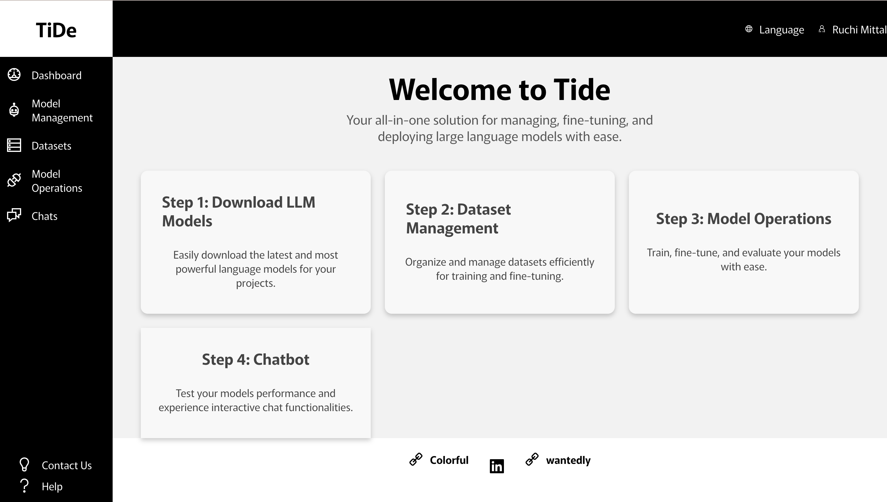
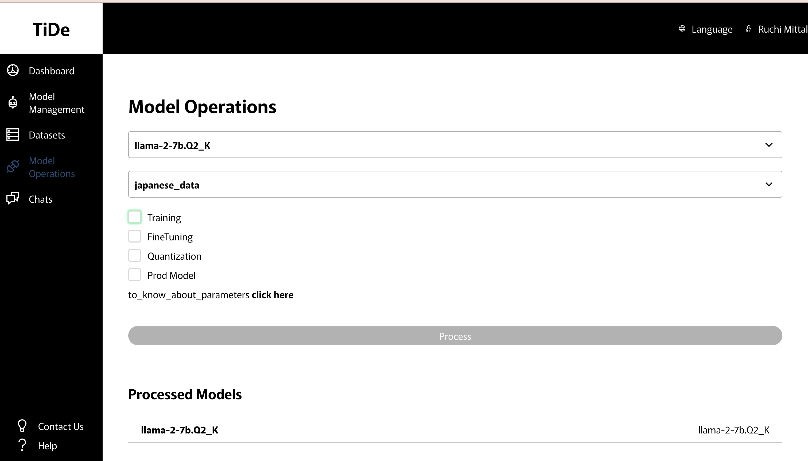
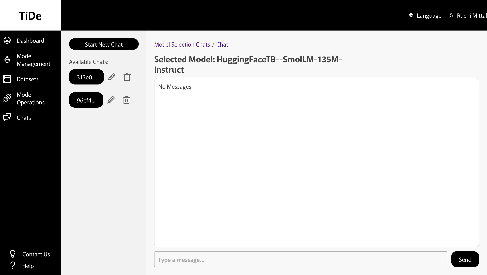

# Tide App Operational Manual

## Features Overview

### 1. Login to the Tide App

Start by logging into the application using your credentials. The authentication system ensures a secure and personalized experience for every user.

### 2. Dashboard

The dashboard serves as the central hub of the application, providing access to all major features. It is designed for ease of navigation and offers an overview of available options and functionalities.

### 3. Model Management (Upload/Download LLM Models)

The application enables users to upload or download different variations of LLM models locally. This feature supports flexibility in managing model versions and facilitates experimentation with various architectures.

### 4. Datasets

Easily integrate custom datasets for your models. This feature is particularly useful for training and fine-tuning models with domain-specific prompts, enhancing their performance in specialized tasks.

### 5. Model Operations

Perform advanced operations on models, including:

- **Training**: Develop models with new data.
- **Fine-tuning**: Adapt pre-trained models to specific tasks.
- **Quantization**: Optimize model size and speed without significant performance loss.

### 6. Custom Chatbot Features

#### 6(a). Build a Custom Chatbot

Select a specific model from the library to create your own chatbot. Customize it with tailored datasets and configurations to suit your requirements.

#### 6(b). Chatbot Interface

This feature provides a user-friendly interface for interacting with your custom chatbot. Test its functionality, refine its responses, and deploy it for real-world applications.

## Contact Us 📞

For any issues, queries, or suggestions, feel free to reach out:

📧 Email: wave@aiglow.ai
🌐 Website: [COLORFUL](https://colorful-inc.jp/)
🐞 GitHub Issues: [Report an Issue](https://github.com/ColorfulAIWave/TideAI/issues)
