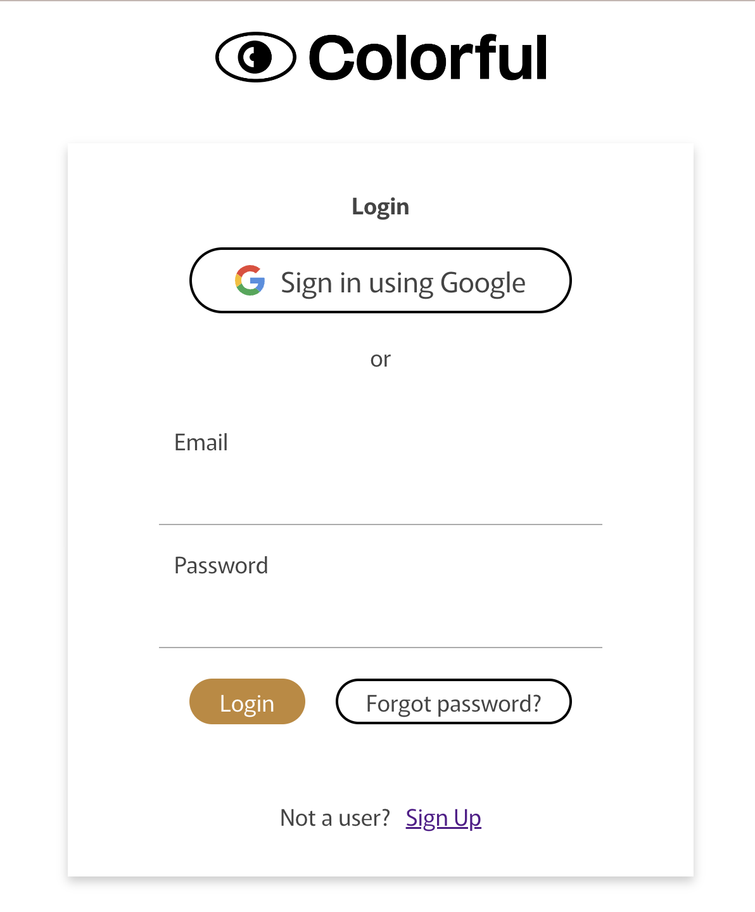
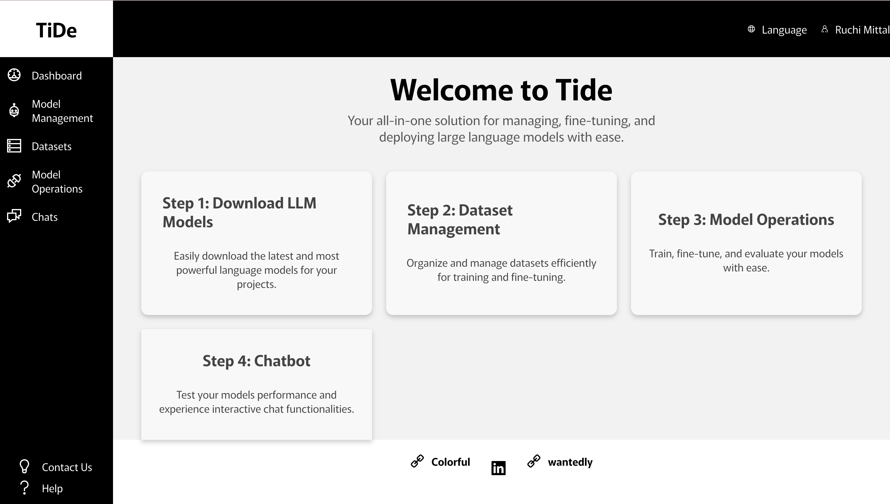
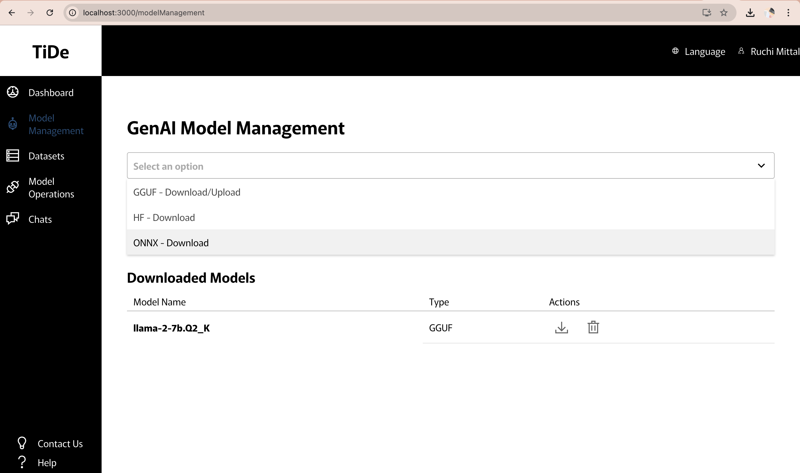
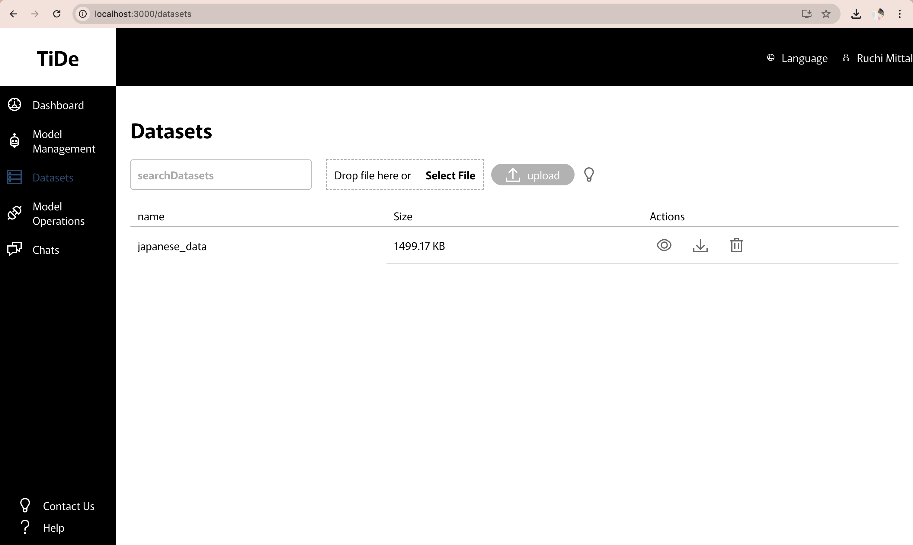
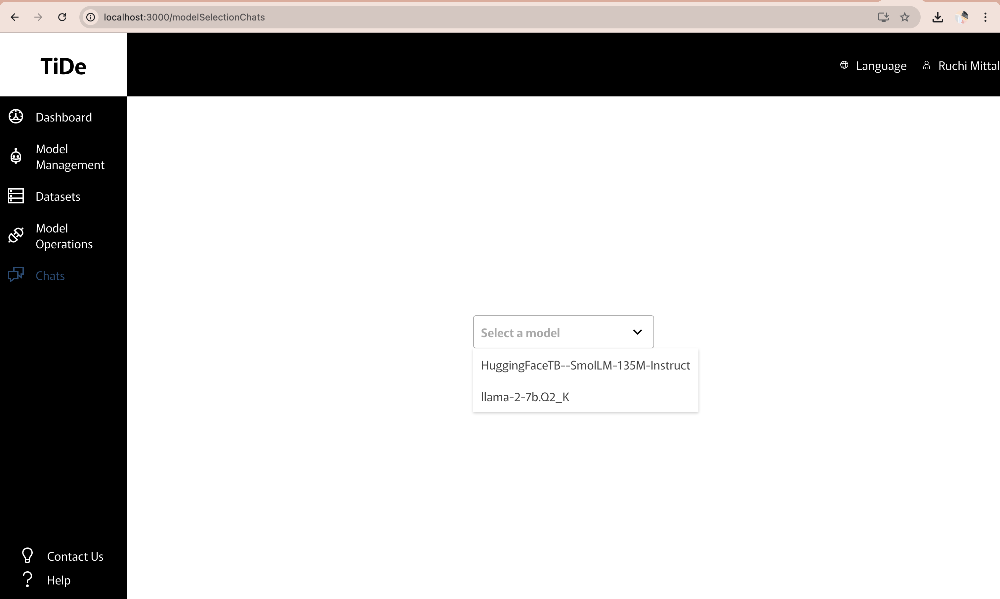
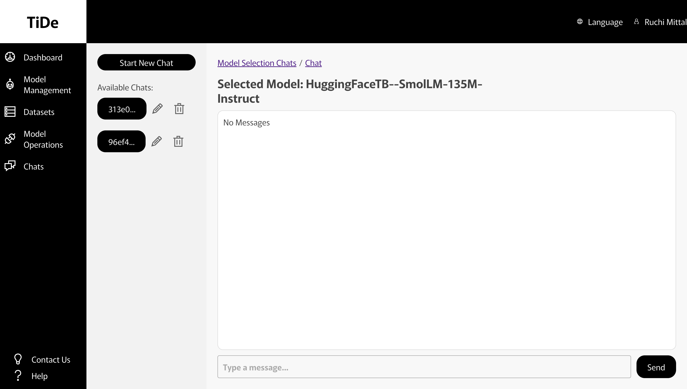

#

[COLORFUL](https://colorful-inc.jp/)


At **[COLORFUL](https://colorful-inc.jp/)**, we focus on delivering diverse possibilities to the world through IT services. Our mission is to provide a place where all individuality can shine. As a member of a long-established global IT corporate group, Colorful respects each individual and continues to provide new possibilities as a powerful team of colorful personalities.

---

## TideAI

**Introducing Tide: Your All-in-One Local LLM Solution**

Tide, an AI product developed by **[COLORFUL](https://colorful-inc.jp/)**, is a flexible, open-source platform that simplifies the development and deployment of AI applications. Tide provides a safe, user-friendly platform for building and deploying LLM-powered applications, regardless of technical expertise.

---

## Key Features 🚀

Tide simplifies managing, fine-tuning, and deploying large language models (LLMs). It is built to **run LLMs locally**, ensuring hassle-free operations without the need for extensive technical expertise. Tide’s simple design makes advanced generative AI capabilities accessible to everyone, fostering innovation and creativity at every level.

1. **Simplified Model Downloads** 📥  
   Easily download, manage, and version control LLMs from various sources (Hugging Face, ONNX, etc.).
   No complex configurations— just download and start exploring.

2. **Intuitive Dataset Management** 📂

   - Organize and manage datasets
   - Tailor datasets for model training and fine-tuning while ensuring complete security of your sensitive \* information is easy with TideAi.
   - Create personalized bots without compromising data privacy.

3. **Streamlined Model Operations** ⚙️

- Train, fine-tune, and quantize LLMs with a straightforward interface.
- Tide’s user-friendly tools eliminate the technical barriers to working with advanced AI models.

4. **Interactive Chatbot Testing** 💬
   - Experience and test trained models with Tide’s built-in chatbot feature.
     -- Quickly deploy and test models with an interactive chatbot.
     -- See your personalized bot in action and refine its performance with real-time feedback.

---

## Why Choose Tide? 🌟

1. **Privacy and Security:** Run LLMs directly on your machine, ensuring privacy and control.
2. **Cost-Effective:** Avoid expensive cloud infrastructure costs.
3. **Customization and Control:** Tailor LLMs to your specific needs and requirements.
4. **Flexible Model Support:** Works with a wide range of LLM frameworks and formats, providing flexibility and compatibility.
5. **Efficient Model Training and Fine-Tuning:** Train and fine-tune models quickly and efficiently, leveraging advanced optimization techniques.
6. **Rapid Iteration:** Experiment and iterate quickly on your models.
7. **User-Friendly Interface:** A simple interface makes it easy to get started with LLMs, even for those without extensive technical expertise.

---

## Requirements 🛠️

To get started with TideAI, ensure the following are installed:

- [Python](https://www.python.org/) (Version 3.8 or above) 🐍
- [Node.js](https://nodejs.org/en) (Version 16 or above) 🌐

---

## Account Requirements 🔐

- A GitHub account is required for code collaboration and management.

---

## Installation Guide 📖

You can set up **TideAI** in two ways:

---

### 1. Via Docker 🐳

Follow these steps to set up TideAI using Docker:

1. **Clone the Repository** 📂

```
   git clone https://github.com/ColorfulAIWave/TideAI.git
   cd TideAI
```

2. **Install Docker**
   Download and install Docker from the official Docker website.

3. **Enable Docker**
   Ensure Docker is running on your system.

4. **Run TideAI with Docker Compose**
   Open a terminal, navigate to the TideAI folder, and run:
   ```
   docker-compose up
   ```

---

### 2. Manual Installation 🛠️

Follow these steps for manual installation:

1. **Clone the Repository** 📂

```
git clone https://github.com/ColorfulAIWave/TideAI.git
cd TideAI
```

2. **Frontend Installation** 🌐

Navigate to the frontend directory:

```
cd Frontend/client
```

Install Node.js (version 22.\* LTS version from https://nodejs.org/en) and also all the dependencies required for the project using following command:

```
npm install
npm install -g serve
```

The frontend requirements are now installed! 🎉

3. **Backend Installation** ⚙️

Go back to the backend directory:

```
cd ../../Backend
```

Create a Python virtual environment:

```
python -m venv venv
```

Activate the virtual environment (MAC):

For Mac/Linux:

```
source venv/bin/activate
```

Activate the virtual environment (Windows):

```
venv\Scripts\activate
```

Install backend dependencies:

```
pip install -r requirements.txt
```

The backend requirements are now installed! 🎉

4. **Running the Application** ▶️

4(A) **_Start the Backend server:_**

```
uvicorn main:app --reload
```

4(B) **_Start the Frontend server:_**

```
serve -s build
```

---

# Tide App Operational Manual

## Features Overview

### 1. Login to the Tide App

Start by logging into the application using your credentials. The authentication system ensures a secure and personalized experience for every user.



### 2. Dashboard

The dashboard serves as the central hub of the application, providing access to all major features. It is designed for ease of navigation and offers an overview of available options and functionalities.



### 3. Model Management (Upload/Download LLM Models)

The application enables users to upload or download different variations of LLM models locally. This feature supports flexibility in managing model versions and facilitates experimentation with various architectures.



### 4. Datasets

Easily integrate custom datasets for your models. This feature is particularly useful for training and fine-tuning models with domain-specific prompts, enhancing their performance in specialized tasks.



### 5. Model Operations

Perform advanced operations on models, including:

- **Training**: Develop models with new data.
- **Fine-tuning**: Adapt pre-trained models to specific tasks.
- **Quantization**: Optimize model size and speed without significant performance loss.


### 6. Custom Chatbot Features

#### 6(a). Build a Custom Chatbot

Select a specific model from the library to create your own chatbot. Customize it with tailored datasets and configurations to suit your requirements.



#### 6(b). Chatbot Interface

This feature provides a user-friendly interface for interacting with your custom chatbot. Test its functionality, refine its responses, and deploy it for real-world applications.



## Contact Us 📞

For any issues, queries, or suggestions, feel free to reach out:

📧 Email: wave@aiglow.ai
🌐 Website: [COLORFUL](https://colorful-inc.jp/)
🐞 GitHub Issues: [Report an Issue](https://github.com/ColorfulAIWave/TideAI/issues)
